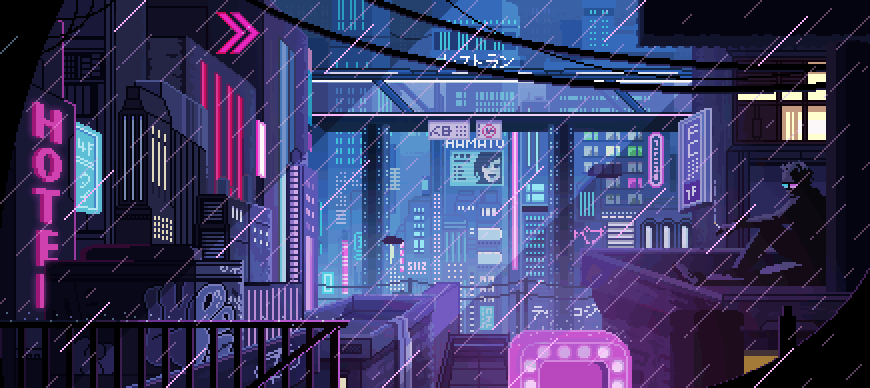
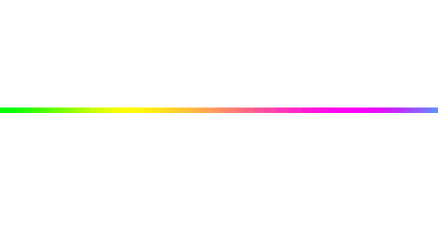
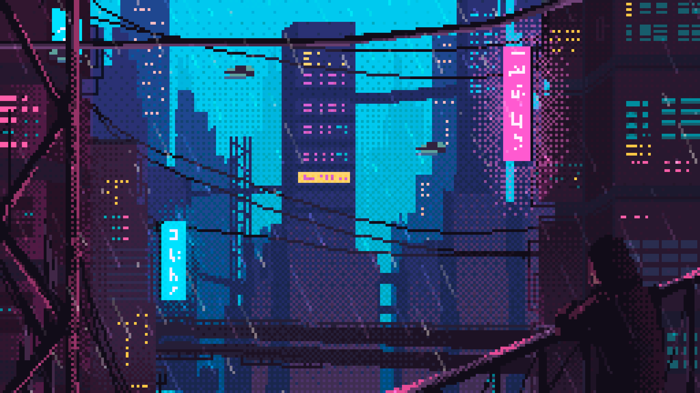

  

<h1 align="center">
  💻  Seja Bem-Vindo  💻
   
  
</h1>

  

  

Sou um **Desenvolvedor Full Stack** com **Bacharelado em Sistemas de Informação**, direto de **Santa Catarina, Brasil**

- No dia a dia desenvolvo com **Node.js, React e MySQL**, usando tecnologia de maneira criativa para resolver problemas e gargalos reais de operação
- Fora do expediente, atuo na **[Evolutiva Sistemas](https://github.com/Evolutiva-Sistemas)**, um projeto próprio de desenvolvimento de sistemas
- Sempre estudando novas tecnologias, arquitetura e maneiras de evoluir como profissional
- Meu objetivo é automatizar, otimizar e inventar soluções estáveis, sem deixar dívida técnica pra amanhã
- Acredito que conhecimento existe pra ser compartilhado: leciono cursos voluntários e escrevo no **[blog da Evolutiva](https://evolutivasistemas.com.br/blog)**
- Gostou do que viu? Bora trocar uma ideia, contatos lá no final 👇

  

  

 

  

  
  

  

  

  

  
  
  

  

<h1 align="center">
  
   
  
</h1>
